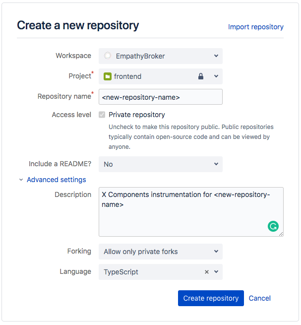

# X Components Archetype

The purpose of this project is to be the starting point for a customer X Components setup.

## Getting started

### Cloning the project

The first step to start a new setup with the archetype is to clone the archetype project.

1. Create the new repository in bitbucket accessing this URL and entering the name of the new repository. The repository name `<new-repository-name>` will be used in the next commands:
    
    [https://bitbucket.org/repo/create?owner=colbenson](https://bitbucket.org/repo/create?owner=colbenson)  
    

2. To clone the Archetype in your local execute the next command replacing `<new-repository-name>` with your new repository name used in the step 1:

    ````
    git clone -b master https://bitbucket.org/colbenson/x-components-archetype.git <new-repository-name>
    ````

3. Then access to the directory:

    ````
    cd <new-repository-name>
    ````

4. Finally, reinitialize the repository and add the new repository:

    ````
    rm -rf .git
    git init
    git remote add origin https://bitbucket.org/colbenson/<new-repository-name>.git
    git add .
    git commit -m "initial commit"
    git push -u origin master
    ````

### Install and execute

1. To install the dependencies execute this:

    ````
    npm install
    ````

2. After installing, you can run the project:

    ````
    npm run serve
    ````
    
### Configure Adapter

Configure the adapter in [x-components/adapter.ts](../src/x-components/adapter.ts) file. Remember to export it to use in the plugin configuration (see next section). You can find more information about the adapter here: [search-adapter](https://bitbucket.org/colbenson/search-adapter/src/master/README.md)
     
### Configure Plugin

Modify the plugin options [x-components/plugin.options.ts](../src/x-components/plugin.options.ts) file. The adapter is mandatory and is imported from the pervious file.
To know more about the plugin options visit: <!-- TODO: Add here the link to the Plugin doc page-->


