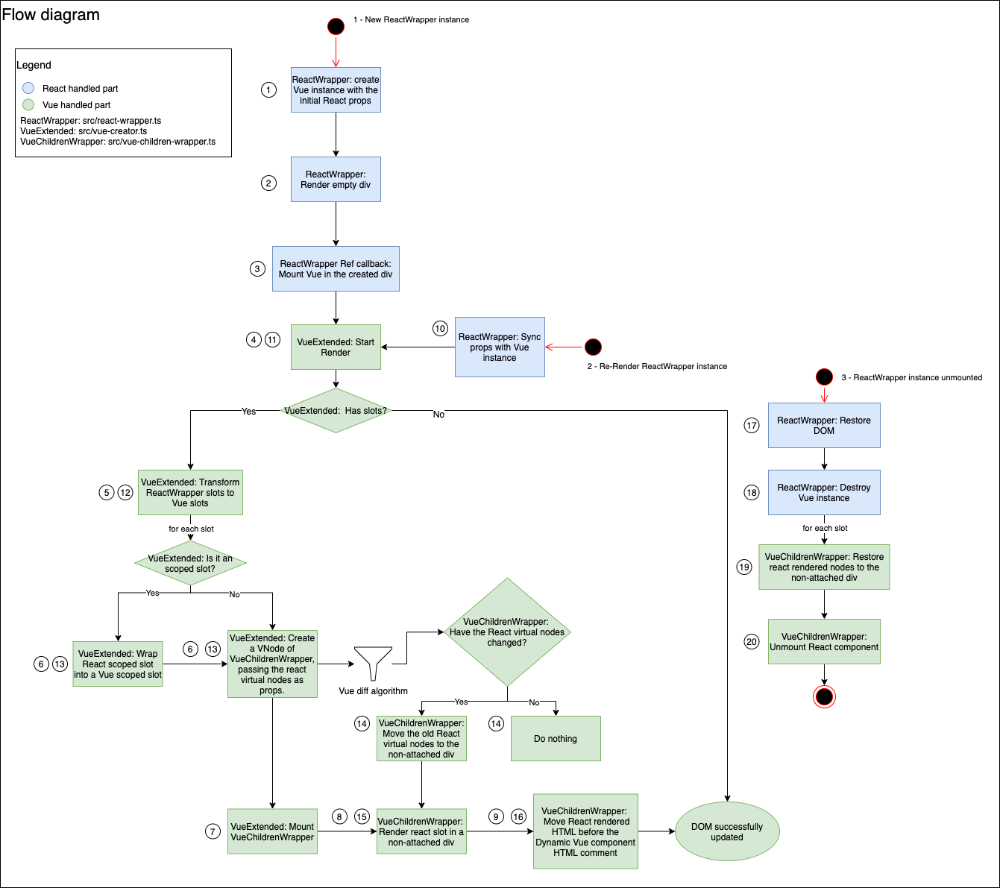
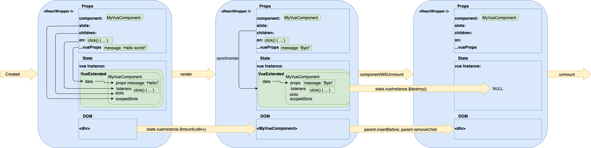

# React wrapper

React wrapper is a library that allows to use Vue components inside a React project. It tries to
provide the same APIs that Vue has, but in a React way: props, events, slots, scoped slots...

## Usage guide

To start using this library, simply add it to your React project dependencies, together with
`react`, `react-dom`, and `vue`:

```
npm install --save @empathy/react-wrapper react react-dom vue
```

After installing these dependencies, you can start using the `ReactWrapper`. To do so, you just have
to use it like a normal React component, the only required prop is the `component` one, which must
be passed with the Vue component to render.

```vue
// File hello-world.vue
<template>
  <h1>Hello world!</h1>
</template>
```

```tsx
// File App.ts
import { ReactWrapper } from '@empathy/react-wrapper';
import HelloWorld from './hello-world.vue';
import React from 'react';

function App() {
  return (
    <main>
      <ReactWrapper component={HelloWorld} />
    </main>
  );
}
```

### Props

To pass some props to the Vue component rendered by `ReactWrapper`, just pass them as you would with
a normal React component. `ReactWrapper` will forward them to the Vue component:

```vue
// File message.vue
<template>
  <h1>{{ message }}</h1>
</template>
<script>
  export default {
    props: ['message']
  };
</script>
```

```tsx
// File App.tsx
import { ReactWrapper } from '@empathy/react-wrapper';
import Message from './message.vue';
import React from 'react';

function App() {
  return (
    <main>
      <ReactWrapper component={Message} message={'Hello World!'} />
    </main>
  );
}
```

Note that there are some special properties that shouldn't be used. The `on`, `children` and `slots`
props are used to expose other Vue APIs. This is explained in the [events](#markdown-header-events)
and [children & slots](#markdown-header-children--slots) sections.

### Events

While React treats events callbacks as normal props, Vue makes a distinction between them and the
normal ones. That's why, to use events in the `ReactWrapper` you have to use a special prop called
`on`. This prop is just a dictionary of events callbacks, where the key is the event name, and the
value is the callback itself, which can have a payload associated.

```vue
// File button.vue
<template>
  <button @click="emitClick">Click me!</button>
</template>
<script>
  export default {
    methods: {
      emitClick() {
        this.$emit('click:button', 'Button was clicked');
      }
    }
  };
</script>
```

```tsx
// File App.tsx
import { ReactWrapper } from '@empathy/react-wrapper';
import Button from './button.vue';
import React from 'react';

function App() {
  return (
    <main>
      <ReactWrapper
        component={Button}
        on={{ 'click:button': payload => console.log('Click', payload) }}
      />
    </main>
  );
}
```

### Children & Slots

Vue has an advanced API for handling the children of elements. Apart from the traditional default
slot which allows you to pass some children to a component, it provides a way for creating named and
scoped slots. [Named slots](https://vuejs.org/v2/guide/components-slots.html#Named-Slots) allows
passing children to different part of a component, while
[scoped slots](https://vuejs.org/v2/guide/components-slots.html#Scoped-Slots) provides a way for
raising data to the component that provides the slots.

#### Default slots

To use default slots there are 3 ways: nesting the children inside the component, or using the
`children` & `slots.default` props.

```vue
// File title.vue
<template>
  <h1><slot /></h1>
</template>
<script>
  export default {};
</script>
```

```tsx
// File App.tsx
import { ReactWrapper } from '@empathy/react-wrapper';
import Title from './title.vue';
import React from 'react';

function App() {
  return (
    <main>
      <ReactWrapper
        component={Button}
      >
        Hello <strong>World</strong>
      </ReactWrapper>
    </main>
  );
}
```

```tsx
// File App.tsx
import { ReactWrapper } from '@empathy/react-wrapper';
import Title from './title.vue';
import React from 'react';

function App() {
  return (
    <main>
      <ReactWrapper
        component={Title}
        slots={{
          default: ["Hello", <strong>World</strong>]
        }}
      />
    </main>
  );
}
```

#### Scoped & Named slots

```vue
// File article-preview.vue
<template>
  <article>
    <h1>{{ article.title }}</h1>
    <span><slot name="author" :author="author" /></span>
    <div>{{ article.body }}</div>
    <slot name="extra" />
  </article>
</template>
<script>
  export default {
    props: ['article'],
    computed: {
      author() {
        return article.author || 'Anonymous';
      }
    }
  };
</script>
```

```tsx
// File App.tsx
import { ReactWrapper } from '@empathy/react-wrapper';
import ArticlePreview from './article-preview.vue';
import React from 'react';

const article = {
  title: 'Vue slots API',
  body: 'A short guide about how to use vue slots.'
}

function App() {
  return (
    <main>
      <ReactWrapper
        component={ArticlePreview}
        article={article}
        slots={{
          author: (computedAuthor) => <strong>computedAuthor</strong>,
          extra: <a href="#">Read more</a>
        }}
      />
    </main>
  );
}
```

## Architecture

`ReactWrapper` works by creating an internal Vue instance that is mounted inside the `ReactWrapper`
component. Vue rendered content is inserted inside the `div` element rendered by the ReactWrapper,
taking control of the DOM tree from that part.

Proxying APIs is the "easy" part of this library. React flexibility helps when exposing Vue APIs
like events or slots. `ReactWrapper` only has to sync the props received with its internal Vue
instance ones. Whenever the props change, it extracts them again, and notifies the Vue instance
about them.

The biggest challenge of this library is the DOM reconciliation. As the DOM is handled by both Vue
and React, they expect to have full control of it, and if one library makes a change to the DOM.
But, because `ReactWrapper` renders a `div`, and Vue content is inserted inside it, there are no
problems. React has control of the app until this `div`, and Vue from that point.

On the other hand, slots are a bit more complex. Slots work by using a special Vue component,
`VueChildrenWrapper`. This component renders a `div`, and receives React virtual nodes as props.
When the `VueChildrenWrapper` component is mounted, it renders the React nodes inside it. Just like
the `ReactWrapper` does with the children nodes.

The problematic part here is unmounting a component which has animations. When the Vue component is
destroyed, the React one should be destroyed too. The challenge is that Vue fires `beforeDestroy`
and `destroyed` hooks before the component is removed from the DOM, and then it runs the leaving
animations if it has. So the solution is to observe the nodes with a `MutationObserver`. If the
nodes are detached, then it is safe to unmount the React component too.



