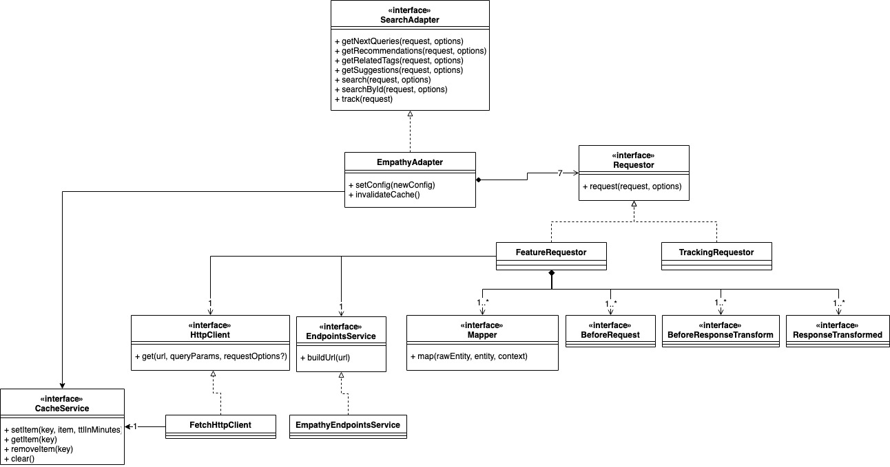

# Empathy Search Adapter

Empathy Search Adapter is a library for making it easier to consume Empathy Search APIs. The project, contains two main parts: an implementation to consume Empathy standard Search API, and an interface that you can use to build you own adapter to any API, so it can be used later with the **EmpathyX** project.

## Table of contents

1. [Using the EmpathyAdapter](#markdown-header-using-the-empathyadapter)
    1. [How can I get an instance of the Empathy Search Adapter?](#markdown-header-how-can-i-get-an-instance-of-the-empathy-search-adapter)
    2. [How can I use the Empathy Search Adapter?](#markdown-header-how-can-i-use-the-empathy-search-adapter)
    3. [How can I configure the Empathy Search Adapter?](#markdown-header-how-can-i-configure-the-empathy-search-adapter)    
    4. [How can I invalidate the cache?](#markdown-header-how-can-i-invalidate-the-cache)    
2. [Extending the Empathy Search Adapter](#markdown-header-extending-the-empathy-search-adapter)
    1. [How can I modify the response mappers?](#markdown-header-how-can-i-modify-the-response-mappers)
    2. [How can I modify the request mappers?](#markdown-header-how-can-i-modify-the-request-mappers)
    3. [How can I add hooks?](#markdown-header-how-can-i-add-hooks)
    4. [What parameters are available in the context?](#markdown-header-what-parameters-are-available-in-the-context)
    5. [How can I enable the cache?](#markdown-header-how-can-i-enable-the-cache)
    6. [How can I do more advanced injection?](#markdown-header-how-can-i-do-more-advanced-injection)
    7. [Which is the Empathy Adapter Architecture?](#markdown-header-which-is-the-empathy-adapter-architecture)    
3. [Building your own adapter](#markdown-header-building-your-own-adapter)

## Using the Empathy Search Adapter

### How can I get an instance of the Empathy Search Adapter?

You can use a builder that will help you configuring the Empathy Search Adapter. If you simply need an adapter, without any advanced settings, you can run this code:

```javascript
import { EmpathyAdapterBuilder } from '@empathyco/x-adapter';

const adapter = new EmpathyAdapterBuilder()
    .setLang('en')
    .setInstance('my-instance')
    .setScope('desktop')
    .setEnvironment('live')
.build();
```

These are the most common parameters that you may need to create instance, but there are many more explained below. 

### How can I use the Empathy Search Adapter?

After building and configuring the adapter, you can simply call the methods for making the requests. As we are dealing with asynchronous code, each method returns a javascript `Promise`, where you receive the transformed response as a parameter.

```javascript
adapter.search({ start: 0, rows: 24, origin: 'default', query: 'awesome things' })
  .then(searchResponse => console.log('This is awesome', searchResponse));
```

This is an example of how to use the adapter for searching, but there are other methods which correspond with the features that are currently supported:

- `getNextQueries`: Given a query, it retrieves a list of common queries that have been made by other users after the first one.
- `getTopRecommendations`: Returns popular results.
- `getSectionRecommendations`: Returns popular results filtered by a section.
- `getClicksRecommendations`: Returns popular results for a given list of result ids.
- `getQueriesRecommendations`: Returns popular results for a given list of queries.
- `getUserRecommendations`: Returns result recommendations specially selected for a user.
- `getRelatedTags`:  Related tags are used for refining a search. E.g You search for *shirt* and a common related tag would be a color, for example *red*.
- `getSuggestions`: Retrieves query suggestions. A query can be passed inside the request parameters, and then the suggestions retrieved will contain that query.
- `search`: Normal search. It can be filtered, sorted and paged.
- `searchById`: Searches, but only using the identifier of the results.
- `track`: Sends a tracking request. By default add to cart, results click and query events are tracked.

### How can I configure the Empathy Search Adapter?

Along to the `setLang`, `setInstance`, `setScope` and `setEnvironment` to simply set properties, the builder provides also these helpers for creating the configuration:

- `setUserInfo`: The user info (if present) is sent on each request. This userInfo is composed by 3 parameters: `user` which is a UUID of the user, kept between different sessions, `session` which is the session UUID, and `userType` which defines if the user is `new` or `recurrent`.
- `setFeatureConfig`: If you need to modify an endpoint, or add more fields to a response, you can do it with this helper. The first parameter is the feature name, and the second one is the configuration you want to modify.
- `setResultTrackingConfig`: Sets the result tracking config.
- `setFacetConfig`: It helps you configure how facets are mapped. The first parameter is the facet configuration. You only need to provide the values you want to modify, as this will be merged with the default facet configuration. There is also as second optional argument, which is the facet id. If provided that configuration will only be applied to that facet, overriding the defaults.
- `setRequestParams`: Any static request param that the request needs can be set here.
- `withConfiguration`: If you don't like the other methods, you can always build your own configuration with the properties you want to override, and pass it to this method.

This is the full set of properties supported by the EmpathyAdapter. As you saw above, you can pass them either in the builder with the `withConfiguration` method, or in the adapter, with the `setConfig` method.

| Property | Default | Type | Description | 
| -------- | ------- | ---- | ----------- |
| `env` | `'staging'` | `'live'`, `'staging'`, `'test'` | The environment that the adapter is going to target |
| `instance` | `'demo'` | `string` | The client instance that the adapter is going to target |
| `requestParams.scope` | `'desktop'` | `string` | The scope (device) from where the requests are going to be made. By default the Empathy API can only use `desktop` and `mobile` (both in lowercase), but you can request us to add more devices |
| `requestParams.lang` | `'en'` | `string` | The requested language for every request |
| `features[featureName].cacheTtlInMinutes` | `5` for catalog <br><br> `60` for side indices | `number` | The default cache TTL (in minutes) for this feature (0 means disabled) |
| `features[featureName].endpoint` | N/A | `string` | The endpoint that is going to be called for each one the features |
| `features[featureName].responsePaths` | N/A | `Record<string, string>` | A record of strings where the key is the parsed response path (AKA the entity name), and the value is the raw response path |
| `mappings.query.maxLength` | `128` | `number` | How many characters should the query parameter have |
| `mappings.query.maxWords` | `8` | `number` | The maximum words that the query is allowed to have |
| `mappings.facets.default.filterModelName` | `'SimpleFilter'` | `FilterModel`, string | The filter type |
| `mappings.facets.default.isDynamic` | `false` | `boolean` | If the facet is dynamic (the users can input whatever they want) or not |
| `mappings.facets.default.multiSelectable` | `'disabled'` | `MultiSelect` | Whether the facet is multi-selectable or not, and if it is when should this multiselection be mapped (front-end or back-end) |
| `mappings.facets.default.showUnselectedValues` | `true` | `boolean` | If you want the response to send us the rest of unselected filters of a facet or not|
| `mappings.facets.default.prefix.facetId` | The facetId | `string`, `(context: FilterValueMapperParams) => string` | The facet id prefix used by Solr |
| `mappings.facets.default.prefix.noTagFacetId` | The facetId | `string`, `(context: FilterValueMapperParams) => string` | The id of the facet in the no-tag part of the Solr query |
| `mappings.facets.named` | N/A | `Record<string, DeepPartial<FacetConfig>>` | A record of partials configurations for a concrete facet. The key is the facet id, and the partial configuration will be merged with the default one |
| `mappings.tracking.result.add2cart` | `'ebTagging.add2cart'` | `string` | The path of the add to cart tagging for each result |
| `mappings.tracking.result.click` | `'ebTagging.click'`| `string` | The path of the click tagging for each result |
| `mappings.tracking.result.[taggingName]` | N/A | `string` | Any other tagging like wishlist for each result. The key is the taggingName and the value is the path of the response. Relative to each raw result.  |

If you need to customize any of the configurations of the adapter after creating it, you can do so by using the `setConfig({})` method.

```javascript
adapter.setConfig({requestParams: {lang: 'fr'}})
```

### How can I invalidate the cache?

There might be situations where you need to invalidate the cache, for instance after a new deployment or when the APIs are returning inconsistent data. To clear all entries in the cache and force the Adapter to hit the API for the next round of requests, you can use the `invalidateCache` function.

```javascript
adapter.invalidateCache()
```

By default the `EmpathyAdapter` cache is disabled. See [How can I enable the cache?](#markdown-header-how-can-i-enable-the-cache) to learn how to activate it.

## Extending the Empathy Search Adapter

You may need to add more fields to some entity, re-map existing values, or execute any kind of complex logic. The `EmpathyAdapter` provides different methods to help you inject your custom code into the common flow.

### How can I modify the response mappers?

If you want to modify how the adapter maps the entities values, the first thing you will need to do is create the new mapper. A mapper is just a class or a function that receives a non-processed entity (as it comes from the API call), the partially processed entity, and a context. It performs some mapping logic with this data, and returns the entity.

#### Creating a mapper with a function

You can simply define a function which receives the raw entity as the first parameter, the target object as the second parameter, and a third parameter with the mapping context. This method has to return the mapped entity.

```javascript
function mapSizes(rawResult, result, context) {
  return Object.assign(result, {
    sizes: rawResult.sizes || [],
  });
}
```

If you are using TypeScript, you can just implement the `MapResponse<From, To>` interface.

#### Creating a mapper with a class

If you need a more advanced mapper (injection, lots of methods...), you can also use a class. In this case, the class needs to have a `map` method, with exactly the same structure as the function mapper.

```javascript
import { injectable } from 'inversify';

@injectable()
export class SizesResultMapper {
  map(rawResult, result, context) {
      return Object.assign(result, {
        sizes: rawResult.sizes || [],
      });
  }
}
```

Like the mapper with a function, this mapper just adds a new field `sizes` to the result. Have you noticed the `@injectable()` decorator?. This is necessary for the [Inversify](https://github.com/inversify/InversifyJS) dependency injection to work.

If you are working with TypeScript, you can implement the `ResponseMapper<From, To>` interface. Also, a cool thing you could do if you are adding new fields to an entity, is [module augmentation](https://www.typescriptlang.org/docs/handbook/declaration-merging.html#module-augmentation).

Then, you have these options for registering the mapper:
 
#### Add it with the builder to the group of mappers for another entity, and optionally for only a feature.

You just have to call the `addMapper` (for functions) or `addClassMapper` (for classes) method of the builder, and pass it the new mapper, and the entity name that is going to map.

```javascript
import { EmpathyAdapterBuilder } from '@empathyco/x-adapter';

const adapter = new EmpathyAdapterBuilder()
    .addMapper(mapSizes, 'results')
    .build();
```

```javascript
import { EmpathyAdapterBuilder } from '@empathyco/x-adapter';

const adapter = new EmpathyAdapterBuilder()
    .addClassMapper(SizesResultMapper, 'results')
    .build();
```

Optionally, you can pass to these functions a third argument, to only apply this new mapper to a single feature. Following the example, imagine that you only want to add this `size` attribute to the results that come from the search call. You can do so by passing `search` as the 3rd argument.

```javascript
import { EmpathyAdapterBuilder } from '@empathyco/x-adapter';

const adapter = new EmpathyAdapterBuilder()
    .addMapper(CustomResultMapper, 'results', 'search')
    .build();
```

#### Replacing all the mappers of an entity for this new one with the builder.

Perhaps you want to completely override the mappers for an entity. Well, this is also easy to do with the `EmpathyAdapterBuilder`. Just call the `replaceMapper` (for functions) or `replaceClassMapper` (for classes) methods:

```javascript
import { EmpathyAdapterBuilder } from '@empathyco/x-adapter';

const adapter = new EmpathyAdapterBuilder()
    .replaceMapper(mapSizes, 'results')
    .build();
```

```javascript
import { EmpathyAdapterBuilder } from '@empathyco/x-adapter';

const adapter = new EmpathyAdapterBuilder()
    .replaceClassMapper(SizesResultMapper, 'results')
    .build();
```

### How can I modify the request mappers?

You might need to add dynamic request params. Like with the normal mappers for the responses, the builder provides you with a set of methods to add request mappers in different ways. This request mappers behave pretty much the same like the response ones: the first parameter is the rawRequest, or, in other words the request object that has been passed to the adapter method; the second parameter is the target object (you can always modify it or discard it), and the third one is the request context.

This is the simple version with only a function:

```javascript
 function customRequestMapper(rawRequest, request, context) {
    return Object.assign(request, { random: Math.random() });
 }
```

And the version using classes:

```javascript
@injectable()
export class CustomRequestMapper {
  map(rawRequest, request, context) {
    return Object.assign(request, { random: Math.random() });
  }
}
```

Both of them only add a new random parameter to the request. For registering them you have the same options you saw with the response mappers.

If you decide to use functions:

```javascript
import { EmpathyAdapterBuilder } from '@empathyco/x-adapter';

const adapter = new EmpathyAdapterBuilder()
    .addRequestMapper(customRequestMapper)
    .build();
```

```javascript
import { EmpathyAdapterBuilder } from '@empathyco/x-adapter';

const adapter = new EmpathyAdapterBuilder()
    .addRequestMapper(customRequestMapper, 'search')
    .build();
```

```javascript
import { EmpathyAdapterBuilder } from '@empathyco/x-adapter';

const adapter = new EmpathyAdapterBuilder()
    .replaceRequestMapper(customRequestMapper)
    .build();
```

And if you decide to use classes: 

```javascript
import { EmpathyAdapterBuilder } from '@empathyco/x-adapter';

const adapter = new EmpathyAdapterBuilder()
    .addClassRequestMapper(CustomRequestMapper)
    .build();
```

```javascript
import { EmpathyAdapterBuilder } from '@empathyco/x-adapter';

const adapter = new EmpathyAdapterBuilder()
    .addClassRequestMapper(CustomRequestMapper, 'search')
    .build();
```

```javascript
import { EmpathyAdapterBuilder } from '@empathyco/x-adapter';

const adapter = new EmpathyAdapterBuilder()
    .replaceClassRequestMapper(CustomRequestMapper)
    .build();
```

### How can I add hooks?

Hooks are just functions that will be executed at certain time in the flow of an adapter method call. These hooks receive a context with all the possible data that they might need: the request and the response, both with and without processing, the URL, the feature name... And they can be binded to every call, or only to some feature. At the moment there are 3 possible places for this hooks, which are before making the request to the API, before transforming the response, and after transforming the response.

You can add them by calling the `onBeforeRequest`, `onBeforeResponseTransform` and `onResponseTransformed` methods.

```javascript
import { EmpathyAdapterBuilder } from '@empathyco/x-adapter';

const adapter = new EmpathyAdapterBuilder()
    .onBeforeRequest(context => console.log('The request has not been made yet', context))
    .onBeforeResponseTransformed(context => console.log('We have received the response, but it has not been transformed yet', context))
    .onResponseTransformed(context => console.log('Now the adapter response has been transformed', context))
    .build();
```

Then, every time the adapter is called, and parses a response, that hook will be executed, logging to the console the response. 
And, what if you want to execute only this hook for a certain adapter feature? You simply have to pass the feature name as the second argument:

```javascript
const adapter = new EmpathyAdapterBuilder()
    .onResponseTransformed(context => console.log('Suggestions response transformed', context), 'suggestions')
    .build();
```

You can add as many hooks as you want, and do whatever you want inside them. Just think that at this moment they have to be synchronous, and will stop the adapter method call from return until executed, so you can't do things like asynchronous API calls inside them (yet, maybe in the future...). 

### What parameters are available in the context?

Depending on where you are use the context, you have available more parameters that you can use to implement different behaviours. Here is the complete table

|                  | Request Mapper | Before Request Hook | Before Response Transformed Hook | Response Mapper | Response Transformed Hook | 
| ---------------- | :------------: | :-----------------: | :------------------------------: | :-------------: | :-----------------------: |
| `requestOptions` | ✅             | ✅                  | ✅                              | ✅              | ✅                        |
| `feature`        | ✅             | ✅                  | ✅                              | ✅              | ✅                        |
| `url`            | ✅             | ✅                  | ✅                              | ✅              | ✅                        |
| `rawRequest`     | ❌             | ✅                  | ✅                              | ✅              | ✅                        |
| `request`        | ❌             | ✅                  | ✅                              | ✅              | ✅                        |
| `rawResponse`    | ❌             | ❌                  | ✅                              | ✅              | ✅                        |
| `response`       | ❌             | ❌                  | ❌                              | ❌              | ✅                        |

You may seem surprised because the request mapper context does not contain the `rawRequest` property, but this is because these mappers receive it as the first parameter.

### How can I enable the cache?

The `EmpathyAdapter` supports caching some request responses to minimize network load, but this feature comes disabled by default. You can enable it by simply calling the `enableCache` method on the builder. This method also supports passing a custom implementation of the `CacheService`.

```javascript
const adapter = new EmpathyAdapterBuilder()
    .enableCache()
    .build();
```

### How can I do more advanced injection?

The purpose of the builder is to simplify the most common use cases encapsulating Inversify, but maybe you need to add some advancing binding behaviour. There is a method called `configureContainer`, which receives a callback that has access to the Inversify container. If you need to re-bind other things apart from mappers and hooks this is the place to do it. You have a global constant with the binding keys, called `DEPENDENCIES`, which you can use for it.

```javascript
import { EmpathyAdapterBuilder, DEPENDENCIES } from '@empathyco/x-adapter';

const adapter = new EmpathyAdapterBuilder()
    .configureContainer(container => {
      container.rebind(DEPENDENCIES.Requestors.search).to(CustomSearchRequestor)
    })
    .build();
```


With this code, you are basically rebinding the search requestor to some custom class. So when you call the `adapter.search({...})` method, instead of using the default `FeatureRequestor`, your custom one will be executed.

### Which is the Empathy Adapter Architecture?

Summing up, this is the Empathy Search Adapter architecture, so you can better see where each one of the pieces showed in this documentation may fit.



## Building your own adapter

In certain situations, you may need to implement your own Adapter, for instance if you want to have a wrapper on top of a new search platform. You can do so by simply creating a variable with the methods below:

```javascript
var CustomAdapter = {
  getNextQueries(request, requestOptions) { ... },
  getRecommendations(request, requestOptions) { ... },
  getRelatedTags(request, requestOptions) { ... },
  getSuggestions(request, requestOptions) { ... },
  search(request, requestOptions) { ... },
  searchById(request, requestOptions) { ... },
  track(trackingRequest) { ... }
}
```

Each one of this methods receives the request parameters, and the requestOptions, which is a map of any additional params you may need. Finally, this methods must return a `Promise` with the transformed data.

However, it is recommended to use TypeScript for preventing some of the most common errors (typos, using wrong types...), and having better IDE auto-complete features. If you decide to use it, you can import all the types from `@empathyco/x-adapter`. Below, you can find a more advanced example using these types and a `class` instead of a `var`:

```typescript
import {
  NextQueriesRequest,
  NextQueriesResponse,
  RecommendationsRequest,
  RecommendationsResponse,
  RelatedTagsRequest,
  RelatedTagsResponse,
  RequestOptions,
  SearchAdapter,
  SearchByIdRequest,
  SearchByIdResponse,
  SearchRequest,
  SearchResponse,
  SuggestionsRequest,
  SuggestionsResponse,
  TrackingRequest
} from '@empathyco/x-adapter';

export class CustomAdapter implements SearchAdapter {
  getNextQueries(request: NextQueriesRequest, requestOptions: Partial<RequestOptions> = {}): Promise<NextQueriesResponse> { ... }
  getRecommendations(request: RecommendationsRequest, requestOptions: Partial<RequestOptions> = {}): Promise<RecommendationsResponse> { ... }
  getRelatedTags(request: RelatedTagsRequest, requestOptions: Partial<RequestOptions> = {}): Promise<RelatedTagsResponse> { ... }
  getSuggestions(request: SuggestionsRequest, requestOptions: Partial<RequestOptions> = {}): Promise<SuggestionsResponse> { ... }
  search(request: SearchRequest, requestOptions: Partial<RequestOptions> = {}): Promise<SearchResponse> { ... }
  searchById(request: SearchByIdRequest, requestOptions: Partial<RequestOptions> = {}): Promise<SearchByIdResponse> { ... }
  track(trackingRequest: TrackingRequest): Promise<void> { ... }
}
```

These are the basic methods for a custom adapter to work, but there are also some optional methods that you can implement, and which may help you build a more advanced adapter with standardized function names.

* `setConfig(config: ConfigType): void` If your adapter has any kind of configurations, that can be changed dynamically, you can implement this method. As this method is generic, you can pass to it whatever you want.
* `addConfigChangedListener(listener: ConfigChangedListener<ConfigType>): void` Allows a user to subscribe to config changes. The listener will be called whenever the config changes.
* `removeConfigChangedListener(listener: ConfigChangedListener<ConfigType>): void` Allows a user to unsubscribe to config changes.
* `invalidateCache(): void` If your adapter has any cache, you may have the need of invalidate it. Then, you can implement the `invalidateCache` method

Note that for some of these methods to work, you will have to pass a configuration type to the `SearchAdapter` interface.

```typescript
import { SearchAdapter } from '@empathyco/x-adapter'; import { DeepPartial } from './utils.types';

export interface AdvancedAdapterConfig {
  env: 'live' | 'staging';
  lang: string;
}

export class Advanced implements SearchAdapter<AdvancedAdapterConfig> {
  protected config: AdvancedAdapterConfig;
 // ... All mandatory methods have been omitted
  setConfig(newConfig: DeepPartial<AdvancedAdapterConfig>) {
    Object.assign(this.config, newConfig);
  }
}
```
